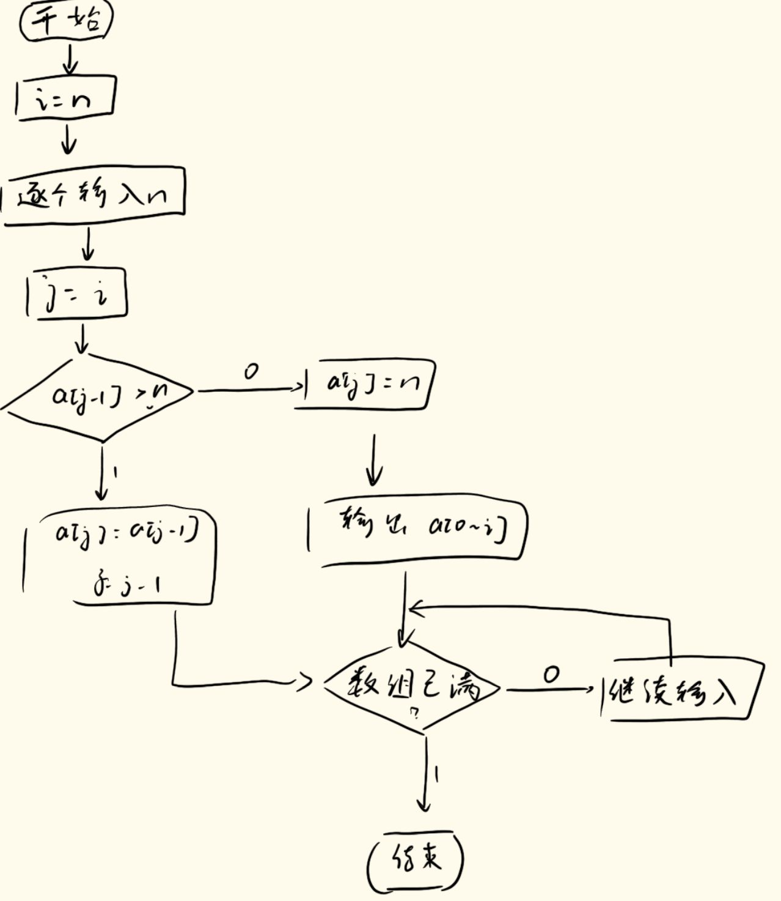

# 第三次作业
**author:** Hommer  

**date:** 1016
## 1. 用迭代法求$\sqrt{x}=a$。求平方根的迭代公式为：$x_{n+1}=(x_n+a/x_n)/2$，要求前后两次求出的x的差的绝对值小于$10^{-5}$。
```dotnetcli
#include <stdio.h>
#include <math.h>

int main() {
    double a;
    const double EPS = 1e-5;
    printf("Enter a non-negative number a (to compute sqrt(a)): ");
    scanf("%lf", &a);
    
    if (a < 0.0) {
        printf("Cannot compute real square root of a negative number.\n");
        return 1;
    }
    if (a == 0.0) {
        printf("sqrt(0) = 0.000000\n");
        return 0;
    }

    double x = (a > 1.0) ? a / 2.0 : 1.0; // initial guess
    double next = x;
    int iter = 0;
    const int MAX_ITER = 100000;

    while (iter++ < MAX_ITER) {
        next = 0.5 * (x + a / x);
        if (fabs(next - x) < EPS) break;
        x = next;
    }

    printf("sqrt(%g) = %.6f (iterations: %d)\n", a, next, iter);
    return 0;
}
```

## 2. 编程，求下面方程在(-10,10)的根：$2x^3-4x^2+3x-6=0$。
```dotnetcli
#include <stdio.h>
#include <math.h>

double f(double x) {
    return 2.0*x*x*x - 4.0*x*x + 3.0*x - 6.0;
}

double bisection(double a, double b, double tol) {
    double fa = f(a), fb = f(b), m, fm;
    int iter = 0, max_iter = 1000;
    while ((b - a) / 2.0 > tol && iter++ < max_iter) {
        m = (a + b) / 2.0;
        fm = f(m);
        if (fm == 0.0) return m;
        if (fa * fm < 0.0) { b = m; fb = fm; }
        else { a = m; fa = fm; }
    }
    return (a + b) / 2.0;
}

int main(void) {
    const double left = -10.0, right = 10.0;
    const double step = 0.01;
    const double tol = 1e-12;
    double a = left, b;
    double roots[16];
    int nroots = 0;

    for (a = left; a < right; a += step) {
        b = a + step;
        if (b > right) b = right;
        double fa = f(a), fb = f(b);
        double r;
        if (fabs(fa) < 1e-14) r = a;
        else if (fa * fb < 0.0) r = bisection(a, b, tol);
        else continue;

        if (!(r > left && r < right)) continue; // keep roots strictly inside (-10,10)

        // check duplicate (compare with all found roots)
        int dup = 0;
        for (int i = 0; i < nroots; ++i) {
            if (fabs(r - roots[i]) < 1e-8) { dup = 1; break; }
        }
        if (!dup && nroots < (int)(sizeof(roots)/sizeof(roots[0]))) {
            roots[nroots++] = r;
        }
    }

    if (nroots == 0) {
        printf("No real root found in (%.1f, %.1f).\n", left, right);
    } else {
        printf("Found %d real root(s) in (%.1f, %.1f):\n", nroots, left, right);
        for (int i = 0; i < nroots; ++i) {
            printf("x%d = %.12f\n", i+1, roots[i]);
        }
    }

    return 0;
}
```

x1 = 2.000000000000

## 3. 两个羽毛球队进行比赛，各出3人。甲队3人为A，B，C，乙队3人为X，Y，Z。已知比赛的名单有如下一些消息：A说他不和X比，C说他不和X，Z比，编程找出3对赛手的名单，并输出。
```dotnetcli
#include <stdio.h>

int main() {
    char *namesA[3] = {"A", "B", "C"};
    char *namesX[3] = {"X", "Y", "Z"};
    int i, j, k;
    int count = 0;

    // i for A's opponent, j for B's opponent, k for C's opponent
    for (i = 0; i < 3; ++i) {
        for (j = 0; j < 3; ++j) {
            if (j == i) continue;
            for (k = 0; k < 3; ++k) {
                if (k == i || k == j) continue;

                // Constraints:
                // A does not play X  -> A_opponent != X (index 0)
                // C does not play X or Z -> C_opponent != X (0) and != Z (2)
                if (i == 0) continue;            // A vs X forbidden
                if (k == 0 || k == 2) continue; // C vs X or Z forbidden

                // valid matching
                printf("Match set %d:\n", ++count);
                printf("A vs %s\n", namesX[i]);
                printf("B vs %s\n", namesX[j]);
                printf("C vs %s\n\n", namesX[k]);
            }
        }
    }

    if (count == 0) {
        printf("No valid matching found with the given statements.\n");
    }

    return 0;
}
```

Match set 1:

A vs Z

B vs X

C vs Y

## 4. 编程求解三色球问题。一个口袋中放有12个球，其中有3个红的，3个白的和6个黑的，若从中任取8个，共有多少种颜色的搭配？
```dotnetcli
#include <stdio.h>

long long comb(int n, int k) {
    int i;
    if (k < 0 || k > n) return 0;
    if (k == 0 || k == n) return 1;
    if (k > n - k) k = n - k;
    long long res = 1;
    for (i = 1; i <= k; ++i) {
        res = res * (n - k + i) / i;
    }
    return res;
}

int main() {
    int total_pick = 8;
    int R = 3, W = 3, B = 6;
    int dist_count = 0;
    long long ways_total = 0;
    int i,r,w,b;

    printf("All color distributions (r,w,b) with r+w+b = %d:\n", total_pick);
    for (r = 0; r <= R; ++r) {
        for (w = 0; w <= W; ++w) {
            b = total_pick - r - w;
            if (b < 0 || b > B) continue;
            ++dist_count;
            long long ways = comb(R, r) * comb(W, w) * comb(B, b);
            ways_total += ways;
            printf("(%d, %d, %d)  ways = %lld\n", r, w, b, ways);
        }
    }

    printf("\nNumber of distinct color distributions: %d\n", dist_count);
    printf("Total number of selection ways (balls distinguishable by identity): %lld\n", ways_total);

    return 0;
}
```

Number of distinct color distributions: **13**

Total number of selection ways (balls distinguishable by identity): 495

## 5. 
1) 画出例3.4-3的流程图，尝试不看源程序写出其伪代码。
```dotnetcli
开始
    定义常量 N = 5
    定义整型数组 a[N]
    定义整型变量 n, i, j
    初始化数组 a 所有元素为 -1

    对 i 从 0 到 N-1 执行：
        输入一个整数 n
        从 j = i 开始向前查找插入位置：
            当 j > 0 且 a[j-1] > n 时：
                a[j] = a[j-1]
                j = j - 1
        将 n 插入到 a[j]
        
        输出当前 a[0] 到 a[i] 的内容
    循环结束

结束
```


2) 将例3.4-5中的数组大小改为宏定义形式，将a数组改为3行4列、b数组改为4行2列并赋值。
```dotnetcli
#include <stdio.h>

#define M 3   // a的行数
#define N 4   // a的列数、b的行数
#define P 2   // b的列数

int main() {
    int a[M][N] = {
        {5, 8, 3, 2},
        {11, 0, 5, 7},
        {4, 6, 9, 1}
    };

    int b[N][P] = {
        {1, 18},
        {2, 11},
        {10, 3},
        {4, 7}
    };

    int c[M][P];
    int i, j, k, s;

    for (i = 0; i < M; i++) {
        for (j = 0; j < P; j++) {
            for (k = s = 0; k < N; k++) {
                s += a[i][k] * b[k][j];
            }
            c[i][j] = s;
        }
    }

    for (i = 0; i < M; i++) {
        for (j = 0; j < P; j++) {
            printf("%6d\t", c[i][j]);
        }
        printf("\n");
    }

    return 0;
}

```
59     201

89     262

110     172

## 6. 编程，将一个数组中的值按逆序重新存放。例如，原来顺序为8，6，5，4，9。现改为9，4，5，6，8。可自行确定数组类型、长度，数组值可语句赋（初）值或由用户键盘输入，要求：输出原始及逆序后数组的所有元素（按下标顺序）。
```dotnetcli
#include <stdio.h>

int main() {
    const int MAX = 100;
    int arr[MAX];
    int n,i;
    int tmp;

    printf("Enter number of elements (1-%d): ", MAX);
    scanf("%d", &n);

    if (n == 0) {
        printf("error\n");
        return 1;
    }
    else {
        if (n < 1 || n > MAX) {
            printf("Invalid size.\n");
            return 1;
        }
        printf("Enter %d integer elements (separated by spaces or newlines):\n", n);
        for (i = 0; i < n; ++i) {
            if (scanf("%d", &arr[i]) != 1) return 1;
        }
    }

    printf("\nOriginal array (index : value):\n");
    for (i = 0; i < n; ++i) {
        printf("%d : %d\n", i, arr[i]);
    }

    // reverse in-place
    for (i = 0; i < n / 2; ++i) {
        tmp = arr[i];
        arr[i] = arr[n - 1 - i];
        arr[n - 1 - i] = tmp;
    }

    printf("\nReversed array (index : value):\n");
    for (i = 0; i < n; ++i) {
        printf("%d : %d\n", i, arr[i]);
    }

    return 0;
}
```

## 7. 编程，从键盘输入一行字符（或简单点，直接语句赋值一行字符亦可），要求统计出其中英文大写字母、小写字母、数字以及其他字符的个数，输出统计结果。
```dotnetcli
#include <stdio.h>
#include <string.h>
#include <ctype.h>

int main() {
    char line[1024];
    printf("Enter a line of text (max 1023 chars):\n");
    if (fgets(line, sizeof line, stdin) == NULL) {
        strcpy(line, "why do you input nothing?\n");
    }

    /* remove trailing newline if any */
    int len = strlen(line);
    int i;
    if (len > 0 && line[len - 1] == '\n') line[len - 1] = '\0';

    int upper = 0, lower = 0, digit = 0, other = 0;
    unsigned char ch;
    for (i = 0; line[i] != '\0'; ++i) {
        ch = (unsigned char)line[i];
        if (isupper(ch)) ++upper;
        else if (islower(ch)) ++lower;
        else if (isdigit(ch)) ++digit;
        else ++other;
    }

    printf("Uppercase letters: %d\n", upper);
    printf("Lowercase letters: %d\n", lower);
    printf("Digits: %d\n", digit);
    printf("Other characters: %d\n", other);

    return 0;
}
```

## 8. 编程，字符数组s1存储一个字符串（可由键盘输入或语句赋值，大小自定），然后将s1中的全部字符复制到字符数组s2中，包括'\0','\0'后的字符不再复制。
```dotnetcli
#include <stdio.h>
#include <string.h>

int main() {
    const int MAX = 256;
    char s1[MAX];
    char s2[MAX];

    printf("Enter a string (max 255 chars): ");
    if (fgets(s1, MAX, stdin) == NULL) return 0;

    /* remove trailing newline if present (optional) */
    int len = strlen(s1);
    if (len > 0 && s1[len - 1] == '\n') s1[len - 1] = '\0';

    /* copy including the null terminator, stop after copying '\0' */
    int i;
    for (i = 0; i < MAX; ++i) {
        s2[i] = s1[i];
        if (s1[i] == '\0') break;
    }

    printf("s1: \"%s\"\n", s1);
    printf("s2: \"%s\"\n", s2);
    printf("Copied %zu bytes (including null terminator)\n", i + 1);

    return 0;
}
```

## 9. 将例3.5-1改成从键盘输入所有坐标，先判断点的关系（是否重合、X轴坐标是否相等）再计算斜率。
```dotnetcli
#include <stdio.h>
#include <math.h>
int main(){
    struct point{
        float x;
        float y;
    };
    struct point p1, p2;

    printf("请输入p1的x和y坐标：");
    scanf("%f %f", &p1.x, &p1.y);
    printf("请输入p2的x和y坐标：");
    scanf("%f %f", &p2.x, &p2.y);

    if (fabs(p1.x - p2.x) < 1e-6 && fabs(p1.y - p2.y) < 1e-6) {
        printf("两点重合，无法计算斜率。\n");
        return 0;
    }

    if (fabs(p2.x - p1.x) < 1e-6) {
        printf("两点x轴坐标相同\n");
        return 0;
    }

    printf("p1-p2的斜率为：%f\n", (p2.y - p1.y) / (p2.x - p1.x));

    return 0;
}

```

## 10. 有5个学生，每个学生的信息包括姓名及2门课程的成绩。编程，从键盘输入5个学生数据，并分别输出2门课程的平均成绩及最高分的学生信息（姓名、成绩）。自定义数据结构，得到准确结果即可。
```dotnetcli
#include <stdio.h>

#define N 5   // number of students

// Define the structure to store student information
struct Student {
    char name[20];
    float score1;
    float score2;
};

int main() {
    struct Student stu[N];
    int i;
    float sum1 = 0, sum2 = 0;
    float max_total = 0;
    int max_index = 0;

    // Input student data
    printf("Please enter the name and two course scores for 5 students:\n");
    printf("Format: name score1 score2\n");

    for(i = 0; i < N; i++) {
        scanf("%s %f %f", stu[i].name, &stu[i].score1, &stu[i].score2);
        sum1 += stu[i].score1;
        sum2 += stu[i].score2;

        float total = stu[i].score1 + stu[i].score2;
        if(total > max_total) {
            max_total = total;
            max_index = i;
        }
    }

    // Calculate average scores
    float avg1 = sum1 / N;
    float avg2 = sum2 / N;

    // Output results
    printf("\nAverage score of course 1: %.2f\n", avg1);
    printf("Average score of course 2: %.2f\n", avg2);

    printf("\nStudent with the highest total score:\n");
    printf("Name: %s\n", stu[max_index].name);
    printf("Course 1 score: %.2f\n", stu[max_index].score1);
    printf("Course 2 score: %.2f\n", stu[max_index].score2);
    printf("Total score: %.2f\n", max_total);

    return 0;
}

```

## 11. 编程，比较两个字符串s1和s2（可由键盘输入或语句赋值，大小自定），若s1>s2，输出一个正数，s1==s2输出0，s1<s2，输出一个负数。比较规则为：从头依序一个一个比较2个字符串里的字符，大小根据它们的ASCII码值来定，输出即ASCII码的差值，第一个不相同的字符比较结果即决定s1和s2的大小及输出，若s1和s2完全相同，比较结果显然为0。
```dotnetcli
#include <stdio.h>
#include <string.h>

int main() {
    char s1[100], s2[100];
    int i = 0;
    int diff = 0;

    printf("Enter the first string: ");
    fgets(s1, sizeof(s1), stdin); 
    printf("Enter the second string: ");
    fgets(s2, sizeof(s2), stdin);

    // Remove trailing newline '\n' if present
    s1[strcspn(s1, "\n")] = '\0';
    s2[strcspn(s2, "\n")] = '\0';

    // Compare character by character
    while (s1[i] != '\0' && s2[i] != '\0') {
        if (s1[i] != s2[i]) {
            diff = s1[i] - s2[i];
            break;
        }
        i++;
    }

    // Output result
    printf("\nResult = %d\n", diff);
    if (diff > 0)
        printf("s1 > s2\n");
    else if (diff < 0)
        printf("s1 < s2\n");
    else
        printf("s1 == s2\n");

    return 0;
}

```

## 12. 已知a[20],b[10]两个数组，其中a为升序数组，编程将b数组中的各个元素插入a数组中，并保证a仍为升序数组。要求：另外定义一个数组c[30]，存放最终结果，a，b的元素从键盘输入或直接赋(初)值；输出a，b，c三个数组内容（格式自定）。
```dotnetcli
#include <stdio.h>

#define A_SIZE 20
#define B_SIZE 10
#define C_SIZE (A_SIZE + B_SIZE)

int main() {
    int a[A_SIZE] = {1, 3, 5, 7, 9, 11, 13, 15, 17, 19,
                     21, 23, 25, 27, 29, 31, 33, 35, 37, 39};
    int b[B_SIZE] = {2, 4, 6, 8, 10, 12, 14, 16, 18, 20};
    int c[C_SIZE];
    int i = 0, j = 0, k = 0;

    // ---- 合并两个有序数组 a 和 b 到 c ----
    while (i < A_SIZE && j < B_SIZE) {
        if (a[i] <= b[j])
            c[k++] = a[i++];
        else
            c[k++] = b[j++];
    }

    // 将剩余元素复制进去
    while (i < A_SIZE) c[k++] = a[i++];
    while (j < B_SIZE) c[k++] = b[j++];

    // ---- 输出结果 ----
    printf("Array a: ");
    for (i = 0; i < A_SIZE; i++) printf("%d ", a[i]);

    printf("\nArray b: ");
    for (j = 0; j < B_SIZE; j++) printf("%d ", b[j]);

    printf("\nMerged array c: ");
    for (k = 0; k < C_SIZE; k++) printf("%d ", c[k]);

    printf("\n");

    return 0;
}

```

## 13.多项式具有幂次与系数，例如：$g(x)=a_nx_n+a_{n-1}x_{n-1}+...+a_1x+a_0$，设计一个保存多项式的数据结构并编程，计算多项式的值。（提示：数据结构主要用于保存幂次与系数，例如各用一个数组保存，下标为i，一一对应）
```dotnetcli
#include <stdio.h>
#include <math.h>

#define MAXN 20   // 最大项数

int main() {
    int n;                  // 多项式项数
    double coef[MAXN];      // 系数数组
    int exp[MAXN];          // 幂次数组
    double x, result = 0;   // 自变量x与计算结果

    // 输入项数
    printf("Enter the number of terms in the polynomial: ");
    scanf("%d", &n);

    // 输入每一项的系数和幂次
    printf("Enter coefficient and exponent for each term (a_i, e_i):\n");
    for(int i = 0; i < n; i++) {
        printf("Term %d: ", i + 1);
        scanf("%lf %d", &coef[i], &exp[i]);
    }

    // 输入x值
    printf("Enter the value of x: ");
    scanf("%lf", &x);

    // 计算多项式的值
    for(int i = 0; i < n; i++) {
        result += coef[i] * pow(x, exp[i]);
    }

    // 输出结果
    printf("\nPolynomial: g(x) = ");
    for(int i = 0; i < n; i++) {
        printf("%.2lf*x^%d", coef[i], exp[i]);
        if (i < n - 1) printf(" + ");
    }

    printf("\nWhen x = %.2lf, g(x) = %.4lf\n", x, result);

    return 0;
}

```

## 14. 输出以下的杨辉三角形（要求输出10行）。（提示：每行的头尾为1，其余，每列的数为上一行对应列的数与它的前一列的数之和）
```
1
1 1
1 2 1
1 3 3 1
1 4 6 4 1
1 5 10 10 5 1
```

```dotnetcli
#include <stdio.h>

#define N 10  // 要输出的行数

int main() {
    int a[N][N];  // 用二维数组保存杨辉三角数据
    int i, j;  

    // 生成杨辉三角
    for (i = 0; i < N; i++) {
        for (j = 0; j <= i; j++) {
            if (j == 0 || j == i)       // 每行的第一个和最后一个元素为1
                a[i][j] = 1;
            else                        // 其余元素 = 上一行的两个相邻元素之和
                a[i][j] = a[i - 1][j - 1] + a[i - 1][j];
        }
    }

    // 输出杨辉三角
    for (i = 0; i < N; i++) {
        for (j = 0; j <= i; j++)
            printf("%4d", a[i][j]);  // 每个数宽度4便于对齐
        printf("\n");
    }

    return 0;
}
```
